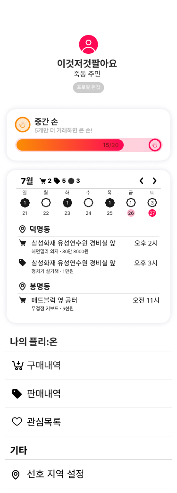

# 라이브 커머스 기반 중고 거래 플랫폼 Flea:On

## 🚩 목차

1. 기획 배경
2. 서비스 소개
3. 기능 소개
4. 기술 스택
5. 프로젝트 일정 및 기타 산출물
6. 팀원 소개 및 소감

## ✨ 기획 배경

### 개요
대량의 물품을 한번에 보다 쉽게 판매할 수 있는, 보다 저렴하게 구매할 수 있는  
**라이브 커머스 기반 중고 거래 플랫폼**

### 기획 배경

**중고 거래 플랫폼 이용 시 불편한 점 (복수 응답)**  

<판매자>  
1. 구매자와의 연락·가격 조율(51%)
2. 게시글 작성 등 거래 준비 과정(37%)
3. 개인정보 노출(34%)
4. 일방적인 거래 취소(29%)  

<구매자> 
1. 거래물품 품질·상태 확인(47%)
2. 사기거래에 대한 불안감(46%)
3. 판매자와의 연락·가격 조율(33%)
4. 개인정보 노출(22%)  

### 현 상황
| 이사&아동 물품의 경우 대량의 상품을 판매  |                     |
| ------------------------------- | ------------------------------ | 
|  |  |  

💥애로사항 : 사용자가 다량의 물품을 판매하기 위해서는 모든 상품의 사진을 찍어 올려야 한다.  
💥결론 : **한 번에 많은 양의 물건을 판매하고 싶은 판매자를 위한 서비스를 제공하자!**

## ✨ 서비스 소개

### 페르소나

- 이사로 인해 대량의 물건들을 빠르게 판매하고 싶은 판매자
  - 많은 중고물품을 한번에 팔 수 있는 플랫폼
  - 라이브로 실시간 판매 가능
  - 하나하나 정보를 입력하지 않고 음성인식 및 자동 카테고리 분류로 간단하게 상품정보 등록  

- 대량의 중고물품을 저렴하게 사고 싶은 구매자
  - 라이브로 실시간 거래약속 생성
  - 한명의 판매자와 여러개의 상품 거래
  - 쇼츠로 편하게 상품 열람

### 기대효과

**내 손 안의 작은 홈쇼핑**  
누구나 간편하게 라이브 방송을 통한 상품 판매 가능  
  
**상품 홍보 숏폼**  
자동으로 생성되는 숏폼과 AI 요약본으로 거래가 완료될 때까지 콘텐츠로 상품 홍보 가능  
  
**퍼스널 소통 어시스턴트**  
챗봇 시스템 도입으로 거래자 간의 소통 최소화  
당신만을 위한 일정 관리 비서, 거래 일정 캘린더 자동 생성  

**대량 구매&판매**  
라이브 커머스를 통해 다량의 물품을 한 번에 판매&구매 가능  
  
  

## ✨ 기능 소개

- **메인 페이지**
  - **현재 진행중인 라이브**: 실시간으로 판매 중인 라이브 목록을 확인할 수 있습니다.
  - **방송 예정 라이브**: 방송 예정 목록을 클릭하면, 예정된 상품들의 목록을 볼 수 있습니다.
  - **판매 상품 쇼츠**: 판매가 종료된 상품들은 쇼츠 형태로 보여집니다.

- **회원가입 & 프로필 페이지**
  - **소셜 로그인**: Google, Kakao 계정으로 간편하게 로그인할 수 있습니다.
  - **프로필 수정**: 프로필 이미지와 닉네임을 수정할 수 있습니다.
  - **지역 수정**: 직거래를 위한 거주 지역을 설정할 수 있습니다.
  - **레벨 시스템**: 거래 횟수에 따라 ‘작은 손’, ‘중간 손’, ‘큰 손’으로 레벨이 올라갑니다.
  - **일정 관리**: 거래 일정은 캘린더에 표시되며, 판매자 또는 구매자 여부에 따라 구분됩니다. 일정은 일주일 단위로 넘길 수 있습니다.
  - **스크랩 목록**: 스크랩한 방송 목록을 확인할 수 있습니다.
  - **구매/판매 목록**: 사용자의 구매 및 판매 내역을 확인할 수 있습니다.

- **라이브 페이지**
  - **라이브 방송 화면**: 실시간 댓글 기능을 통해 판매자와 소통할 수 있으며, 구매하기 버튼을 통해 거래 약속을 잡을 수 있습니다.
  - **상품 목록**: 해당 라이브에서 판매 중인 상품들을 확인할 수 있습니다.
  - **구매하기**: 구매자는 구매하기 버튼을 누르고 거래일자를 선택하여 거래를 성사시킬 수 있습니다.
  - **예약하기**: 최초 예약자가 있으면 '예약하기' 버튼으로 변경되며, 추가 예약이 가능합니다.
  - **쇼츠 보기**: 방송이 종료된 상품의 쇼츠 페이지로 이동하여 해당 상품을 확인할 수 있습니다.

- **방송 생성 페이지**
  - **방송 정보 입력**: 판매자는 방송 정보를 입력하고, 거래 가능 시간을 설정합니다.
  - **물건 입력**: 상품의 이름과 가격을 입력하며, 네이버 카테고리 API를 통해 자동으로 상품 카테고리를 분류합니다.

- **쇼츠 페이지**
  - **AI 요약**: 방송에서 녹음된 상품 정보가 AI를 통해 요약되어 제공됩니다.
  - **구매하기**: 쇼츠 페이지에서도 구매하기 버튼을 눌러 거래일자 선택 후 구매를 진행할 수 있습니다.
  - **실시간 방송 댓글**: 방송 중 달린 댓글들이 시간 순서대로 표시되어 자연스럽게 내용을 확인할 수 있습니다.
  - **쇼츠 탐색**: 위로 스크롤하여 다른 쇼츠를 탐색할 수 있으며, 무한 스크롤로 추가 쇼츠가 로드됩니다.

- **거래 상세 페이지**
  - **상품 보기**: 판매 중인 상품을 조회할 수 있습니다.
  - **상품 쇼츠**: 구매자는 해당 상품의 쇼츠 페이지로 이동할 수 있습니다.
  - **상품 수정 & 삭제**: 판매자는 상품을 수정, 삭제하거나 판매 상태를 변경할 수 있습니다. 판매 완료된 상품은 수정할 수 없습니다.
  - **추가 구매**: 이미 거래가 성사된 상품이라도 거래시간을 새로 설정하지 않고 추가 구매가 가능합니다.

- **채팅 기능**
  - **채팅 목록**: 채팅 이력이 있는 모든 채팅방을 확인할 수 있습니다.
  - **채팅**: 판매자와 구매자 간의 채팅이 가능합니다.
  - **챗봇 도우미**: 판매자가 다량의 물품을 한 번에 처리하는 경우 챗봇이 일부 기능을 자동으로 처리합니다.
    - **거래 시간 변경**: 구매자는 거래 시간 변경 요청을 할 수 있으며, 판매자는 승인 또는 거절 버튼으로 응답할 수 있습니다.
    - **거래 파기**: 거래 파기 버튼으로 대화를 생략하고 거래를 종료할 수 있습니다.
    - **추가 구매**: 구매자는 이미 거래된 상품 외에도 남은 상품을 채팅방에서 추가 구매할 수 있으며, 새로운 채팅방이나 거래 시간을 설정할 필요가 없습니다.

## ✨ 기술 스택

- **프론트엔드** : React, JavaScript, Redux-toolkit, MUI, PWA
- **백엔드** : Spring Boot, Spring Security, JWT, Oauth 2.0, FCM
- **인프라** : Docker, Nginx, Jenkins, Redis, MySQL, Certbot, EC2
- **특화 기술** : OPENVIDU, Clova AI
- **이슈 관리** : JIRA, Mattermost, Notion

### 아키텍처 설계도

## ✨ 프로젝트 일정 및 기타 산출물

### 프로젝트 일정

**전체 일정** : 2024.07.08 ~ 2024.08.16(총 40일)

- **기획** : 2024.07.08 ~ 2024.07.21(총 14일)
- **개발** : 2024.07.22 ~ 2024.08.16(총 26일)

### 플로우 차트

| [Flow Chart](https://tall-rate-83a.notion.site/21a374dcf4984c379d2a8ba718e17f49) |                                   |
| :-------------------------------------------------------------------------------------: | :-------------------------------: |
|                                                            
|                                                            
|                                                            |
|

### 사이트맵

  

### 피그마 화면 정의서

### ERD

### API 명세서

| [API 명세서](https://tall-rate-83a.notion.site/API-81566178f3ac4d43bde9bc517ac9882d) |                                   |
| :-------------------------------------------------------------------------------------: | :-------------------------------: |
|                                                         |   |
|                                                         |   |
|                                                         |   |
|          

## ✨ 화면

|                                                          |                                                               |                                                           |                                                       |
| :------------------------------------------------------: | :-----------------------------------------------------------: | :-------------------------------------------------------: | :---------------------------------------------------: |
|                   |           |  |              |
|                       인트로 화면                        |                       로그인 화면                        |                  닉네임 입력 화면                  |                       회원 추가정보 지역 입력                        |
|  |                   |             |                |
|                     라이브 목록                     |                         쇼츠 목록                         |                       라이브 예정 상품                       |                      프로필페이지                      |
|           |        |   |  |
|                       라이브                        |                          구매하기                          |                    라이브 방송 목록                     |                     쇼츠                     |
|              |                 |      |           |
|                     회원정보수정                     |                       지역수정 화면                        |                     캘린더 일정                      |                     라이브 예정 정보                     |
|         |                     |             |           |
|                        방송 생성 1                         |                           방송 생성 2                           |                       카테고리 분류                       |                       쇼츠 보기                       |
|             |                      |        |             |
|                       쇼츠 AI 요약                       |                         쇼츠 판매 내역                         |                      거래 상세 보기                       |                       채팅 화면                       |
|                         |                    |                                                           |                                                       |
|                        거래 파기 화면                         |                       거래 시간 변경 요청                       |                                                           |                                                       |